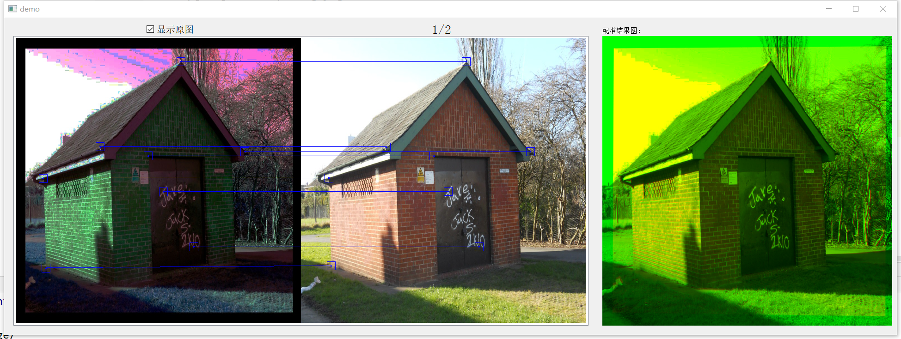
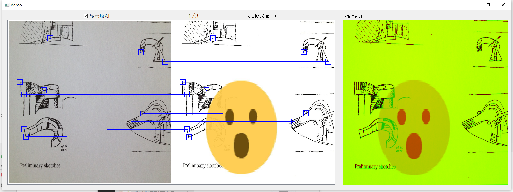
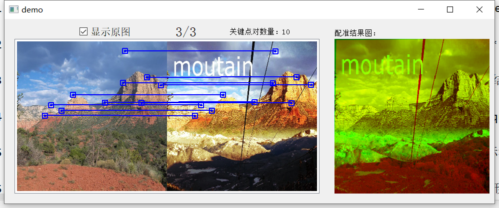

# Image-Matching-Label-Tool

## 使用需知

数据存放在百度网盘https://pan.baidu.com/s/1MoRPFC1XIJW8kBj2k0CdjA, 下载后覆盖image文件即可

1. 使用前请先准备好数据文件，如image文件夹中的格式，包含两个文件夹：query和refer。

2. 将worklist_{user}.txt文件放于main.py同级目录，**使用前先修改main.py第53行self.user,与文件worklist_{user}.txt保持一致**

3. 本工具默认使用image文件夹作为数据集文件，save文件夹下的用户文件夹内保存标注结果。

4. 标注的好坏可以参考最右边子图的配准结果。配准结果是将两图的灰度图叠加，配准的query图放置于红色通道，refer放置于绿色通道。

5. 只有当标注了4个点以上时，才会显示配准结果。为了保证标注的准确性，请每对图像标注主体上的10个关键点，**关键点尽量均匀分散在两图公共区域**。

5. 标注时显示的是一个矩形框，实际存储的位置是该矩形框的中心位置。所以尽量使得矩形框的中心区域更接近要标注的特征点。

## 使用说明

1. 为了分配工作方便，默认读取[worklist_{user}.txt](https://github.com/QzAnsel/Retinal-Label-Tool/blob/master/worklist.txt)文件中的pair对，格式如1005_Z1812_c0 1005_Z1812_a2。该文件可通过generalize_pair.py文件自动生成，会生成该数据集全部的pair对，后续可以手动
分配worklist。

2. 开启程序 (**python main.py**)，会自动读取worklist_{user}.txt的pair对，标注文件保存为query_id-refer_id.txt，其保存格式为**x1 y1 x2 y2**,分别对应query中关键点的x，y坐标与refer图中的x，y坐标。

3. 标注时可以用鼠标左键选择左图或右图中的一个区域点，此时显示的区域框为黄色，可以再次按下鼠标右键取消选中；
然后再次选中另一个图中的一个区域点，则自动产生一个匹配对连线，此时颜色变为蓝色。如果想删除某一个匹配对连线，在这个匹配对的端点区域按下鼠标右键即可删除。

4. 为了方便标注，点击蓝色矩形框内的区域，会让蓝色矩形框的中心点变换到新点击的位置。

5. 本工具可以通过鼠标滚轮或触摸板调整界面大小，方便大家标注

6. 为了操作方便，本工具采用键盘控制翻页和保存。上翻页为键盘A，下翻页为键盘D，保存标注结果为S，注意翻页会自动保存标注结果。

!!!!!!!!!!!!!!!遇到一个ImageQt和PyQt5之间的bug，
使用toqpixmap()前，应将image的rgb模式换到rgba模式

if result.mode == "RGB":
    result = result.convert("RGBA")
result = result.toqpixmap()
